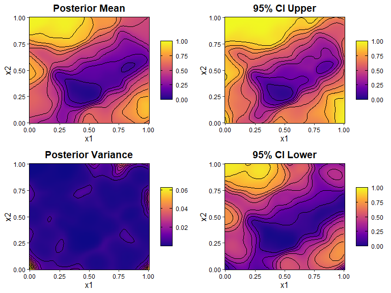

# BKP: Beta Kernel Process Modeling 

<!-- badges: start -->

[](https://deepwiki.com/Jiangyan-Zhao/BKP)
[](https://cran.r-project.org/package=BKP)

[](https://github.com/Jiangyan-Zhao/BKP/actions/workflows/R-CMD-check.yaml)
[](https://app.codecov.io/gh/Jiangyan-Zhao/BKP)
<!-- badges: end -->

**Model covariate-dependent binomial and multinomial probabilities
directly—using flexible kernels and closed-form Beta or Dirichlet
updates, without latent Gaussian variables or MCMC.**

**BKP** provides probability-scale kernel models for binary and
aggregated binomial responses. Kernel-weighted conjugate updating
produces closed-form, pointwise Beta posterior summaries, including
posterior means, variances, credible intervals, quantiles, and
simulations.

The package also implements the **Dirichlet Kernel Process (DKP)** for
categorical and multinomial responses. For larger datasets, **TwinBKP**
and **TwinDKP** combine twinning-selected global subsets with
location-specific nearest-neighbour updates.

<p align="center">

<a href="https://github.com/Jiangyan-Zhao/BKP-paper/blob/master/paper/TR_BKP.pdf"><strong>Software
paper</strong></a> ·
<a href="https://github.com/Jiangyan-Zhao/BKP-paper"><strong>Reproducibility
materials</strong></a> ·
<a href="https://cran.r-project.org/package=BKP"><strong>CRAN</strong></a>
· <a href="https://github.com/Jiangyan-Zhao/BKP/issues"><strong>Issue
tracker</strong></a>
</p>

<div class="figure">


<p class="caption">

BKP posterior mean for a two-dimensional binomial probability surface.
</p>

</div>

## Why BKP?

- **Closed-form posterior summaries:** obtain pointwise Beta or
  Dirichlet posterior quantities without MCMC or numerical posterior
  approximation.
- **Direct probability modeling:** model covariate-dependent
  probabilities without introducing a latent Gaussian process and link
  function.
- **Multiple response types:** support binary, binomial, categorical,
  and multinomial observations.
- **Flexible kernels:** choose Gaussian, Matérn 5/2, Matérn 3/2, or
  compactly supported Wendland kernels with isotropic or anisotropic
  length scales.
- **Automatic tuning:** select kernel length scales by leave-one-out
  cross-validation using the Brier score or log-loss.
- **Scalable approximations:** use TwinBKP or TwinDKP for twinning-based
  global-local modeling of larger datasets.

Optional Shepard effective-sample-size calibration is available for BKP
and DKP. Standard S3 interfaces are provided for prediction, simulation,
plotting, summaries, fitted values, quantiles, and parameter extraction.

## Which model should I use?

| Response type | Full model | Scalable approximation | Shepard ESS calibration |
|:---|:---|:---|:---|
| Binary or binomial | `fit_BKP()` | `fit_TwinBKP()` | Available for BKP |
| Categorical or multinomial | `fit_DKP()` | `fit_TwinDKP()` | Available for DKP |

TwinBKP and TwinDKP do not apply Shepard ESS calibration.

## Installation

Install the stable release, currently **BKP 0.3.0**, from
[CRAN](https://cran.r-project.org/package=BKP):

``` r
install.packages("BKP")
```

Install the development version from
[GitHub](https://github.com/Jiangyan-Zhao/BKP):

``` r
# install.packages("pak")
pak::pak("Jiangyan-Zhao/BKP")
```

The GitHub development version may contain changes that have not yet
been released on CRAN.

## Quick start

For binomial data:

- `X` is an $n \times d$ matrix of covariates;
- `y` contains the observed success counts;
- `m` contains the corresponding numbers of trials;
- `Xbounds` gives the lower and upper bounds of each covariate.

``` r
library(BKP)

fit <- fit_BKP(
  X = X,
  y = y,
  m = m,
  Xbounds = Xbounds
)

summary(fit)
plot(fit, engine = "ggplot")

Xnew <- matrix(
  seq(Xbounds[1, 1], Xbounds[1, 2], length.out = 100),
  ncol = 1
)

pred <- predict(
  fit,
  Xnew = Xnew
)

pred
```

When `theta` is omitted, `fit_BKP()` selects the kernel length scale by
LOOCV. Supply a positive `theta` to skip optimization and fit the model
using a fixed length scale.

<details>

<summary>

<strong>Complete reproducible example</strong>
</summary>

``` r
library(BKP)

set.seed(123)

true_pi_fun <- function(x) {
  (1 + exp(-x^2) * cos(10 * (1 - exp(-x)) / (1 + exp(-x)))) / 2
}

n <- 30
Xbounds <- matrix(c(-2, 2), nrow = 1)
X <- matrix(sort(runif(n, -2, 2)), ncol = 1)

true_pi <- true_pi_fun(X)
m <- sample(80:120, n, replace = TRUE)
y <- rbinom(
  n = n,
  size = m,
  prob = true_pi
)

# A fixed theta is used only to keep this example fast and reproducible.
# Omit theta to select it by leave-one-out cross-validation.
fit <- fit_BKP(
  X = X,
  y = y,
  m = m,
  Xbounds = Xbounds,
  theta = 0.04
)

summary(fit)
plot(fit, engine = "ggplot")

Xnew <- matrix(
  seq(-2, 2, length.out = 100),
  ncol = 1
)

pred <- predict(
  fit,
  Xnew = Xnew
)

head(pred)
```

</details>

## Categorical and multinomial responses

Use `fit_DKP()` when each observation contains categorical or
multinomial counts:

``` r
dkp_fit <- fit_DKP(
  X = X,
  Y = Y,
  Xbounds = Xbounds
)

summary(dkp_fit)
plot(dkp_fit, engine = "ggplot")

dkp_pred <- predict(
  dkp_fit,
  Xnew = Xnew
)
```

DKP replaces the pointwise Beta posterior with a pointwise Dirichlet
posterior and provides class-specific posterior summaries and
classifications.

## Scaling to larger datasets

For larger binomial datasets, replace `fit_BKP()` with `fit_TwinBKP()`:

``` r
twin_fit <- fit_TwinBKP(
  X = X,
  y = y,
  m = m,
  Xbounds = Xbounds
)

summary(twin_fit)
plot(twin_fit, engine = "ggplot")

twin_pred <- predict(
  twin_fit,
  Xnew = Xnew
)
```

TwinBKP combines:

1.  a twinning-selected global subset for broad distributional coverage;
    and
2.  location-specific nearest neighbours for local refinement.

For categorical or multinomial data, use the analogous `fit_TwinDKP()`
interface:

``` r
twindkp_fit <- fit_TwinDKP(
  X = X,
  Y = Y,
  Xbounds = Xbounds
)
```

## Documentation and reproducibility

The statistical foundations, implementation details, and worked examples
are available in:

- [**BKP software paper
  (PDF)**](https://github.com/Jiangyan-Zhao/BKP-paper/blob/master/paper/TR_BKP.pdf)
- [**BKP-paper reproducibility
  repository**](https://github.com/Jiangyan-Zhao/BKP-paper)
- [**Package reference manual on
  CRAN**](https://cran.r-project.org/package=BKP)

The reproducibility repository contains the manuscript source files,
analysis scripts, data-processing code, and materials used to generate
the examples and figures in the software paper.

## Citing BKP

If you use **BKP** in your work, please cite the software paper:

> Zhao, J., Qing, K., and Xu, J. (2025).  
> *BKP: An R Package for Beta Kernel Process Modeling.*  
> arXiv:2508.10447.

For the version-specific R package citation, run:

``` r
citation("BKP")
```

## Development

The BKP package is under active development. Bug reports, feature
requests, and contributions are welcome:

- [Report an issue](https://github.com/Jiangyan-Zhao/BKP/issues)
- [Open a pull request](https://github.com/Jiangyan-Zhao/BKP/pulls)
- [View the source code](https://github.com/Jiangyan-Zhao/BKP)
